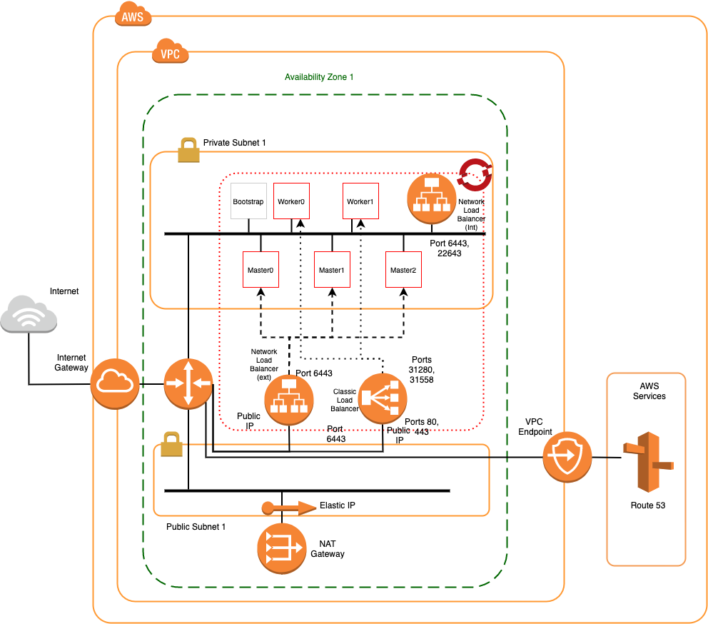

# Quickstart OpenShift on AWS

Provisions OpenShift onto a VPC per the quickstart reference architecture defined [here](https://github.com/cloud-native-toolkit/automation-solutions/blob/aws-ref-arch-entry/architectures/awscloud.md) using Ansible automation.

## Software Dependencies

The module depends upon the following software components being installed on the build machine.

### Command-line Tools

- Ansible version 2.12.1 or higher (follow the guide [here](https://docs.ansible.com/ansible/latest/installation_guide/intro_installation.html))
- AWS CLI version 2.4.11 or higher (follow the guide [here](https://docs.aws.amazon.com/cli/latest/userguide/cli-chap-welcome.html))
- ROSA CLI version 1.1.7 or higher (follow the guide [here](https://docs.openshift.com/rosa/rosa_getting_started/rosa-installing-rosa.html))

## Module Dependences

This module makes use of the following Ansible modules.

- amazon.aws
- amazon.community.aws

## Subscription Dependencies

- AWS administrative access
- Red Hat OpenShift subscription access enabled on AWS

## Example usage

1. Clone this repository

    $ git clone https://github.com/cloud-native-toolkit/ibm-aws-reference-arch-ansible

1. Edit the quickstart.yaml file for required configuration if different than the default below.

    vars:
        awsProfile: default         # The boto profile to be utilized
        awsRegion: ap-southeast-2   # Region into which to create the VPC and cluster
        availZones:                 # Add availability zones as required (must all be part of the above region)
        - 'ap-southeast-2a'
        resourceGroup: 'recloud'    # This is used to identify deployed resources
        vpcCIDR: 10.0.0.0/16        # The VPC subnet to be used (Subnets will be calculated from this)
        subnetPrefix: 24            # The prefix to be used for the required subnets
        openshift_version: 4.9.21   # The openshift version to deploy

1. Run the ansible playbook

    $ ansible-playbook ./quickstart.yaml

When complete, the automation will output the discovered and/or created resources into the inventory.yaml file in the root ansible directory.

    # Cloud Inventory

    arch_type: 'Quickstart'
    inventory:
    Last_Update: Wed  2 Mar 2022 15:30:35 AEDT
    cidrs:
        private:
            cidr: 10.0.64.0/18
            subnets:
            - 10.0.64.0/24
        public:
            cidr: 10.0.0.0/18
            subnets:
            - 10.0.0.0/24
        vpc: 10.0.0.0/16
    igw:
        id: igw-018bdf789da724f31
        name: recloud-igw
    ngw:
    -   addresses:
        -   allocation_id: eipalloc-0cc4ccb26cc6b72fb
            network_interface_id: eni-09d2d89a8a061403b
            private_ip: 10.0.0.201
            public_ip: 3.104.184.48
        id: nat-0b80a808137206415
        name: recloud-ngw-0
        state: available
        subnet_id: subnet-0ed432a1618baf0b0
    profile: default
    region: ap-southeast-2
    resource: recloud
    rosa:
        console: https://console-openshift-console.apps.recloud-rosa.0wet.p1.openshiftapps.com
        dns: recloud-rosa.0wet.p1.openshiftapps.com
        id: 1qmab8h8o43hnv3a86fdu4u2136hedco
        name: recloud-rosa
        state: ready_
    rtbs:
    -   id: rtb-0847cd30763baa1dd
        name: recloud-private-rtb-0
        subnet_id: subnet-0fe628a103b9b884c
    -   id: rtb-02094cd48bad0bcfb
        name: recloud-public-rtb-1
        subnet_id: subnet-0ed432a1618baf0b0
    subnets:
    -   availability_zone: ap-southeast-2a
        cidr: 10.0.64.0/24
        id: subnet-0fe628a103b9b884c
        name: recloud-private-0
    -   availability_zone: ap-southeast-2a
        cidr: 10.0.0.0/24
        id: subnet-0ed432a1618baf0b0
        name: recloud-public-0
    vpc:
        cidr: 10.0.0.0/16
        id: vpc-01969020a699a6bea
        name: recloud-vpc
        state: available

The above inventory can be shown in the following diagram.

